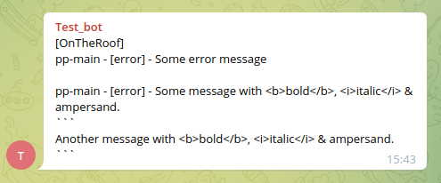
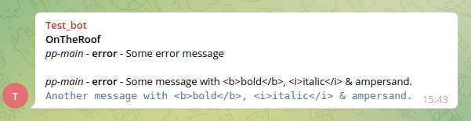

[](https://www.npmjs.com/package/pm2-telegram) [](https://github.com/TrumanRu/pm2-telegram/issues)

# pm2-telegram

**Telegram notifications for PM2 process manager**

## Functions

* collect desired messages to buffer then send collected messages every 10 seconds
* allow messages scope selection (errors, logs, exceptions and kill events)
* truncate long messages (longer than Telegram limitation 4096 characters) to avoid send error
* combine short messages to one message (the resultant big message shorter than 4096 characters) to avoid impact of Telegram messages frequency limitation (see: [My bot is hitting limits, how do I avoid this?](https://core.telegram.org/bots/faq#my-bot-is-hitting-limits-how-do-i-avoid-this))
* set message title for _pm2-telegram_ instance to distinguish messages from one Telegram bot installed on many instances (default is server hostname)
* format messages for better viewing (be aware to face with Markdown characters in raw notification text!)

#### Examples
###### Unformatted

###### Formatted


#### Roadmap

* *(under development)* option to split long messages to many continuous messages (you should choose truncate or split big messages)
* *(under development)* option to display real message's timestamp and set timestamp format (HH:mm:ss.SSS)
* *(under development)* control messages buffer overflow, reset it and send buffer overflow notification

## Setup

### Create bot

* create a Telegram bot with Telegram's BotFather (look at [Telegram documentation](https://core.telegram.org/bots#creating-a-new-bot))
* get BOT_TOKEN from BotFather's answer

### Get chat id

* add the bot to a group if you want to send notifications to a group
* send message from group to the bot: `/test Hello bot!` (use any command-like message started by slash)
* open sent message at `https://api.telegram.org/bot<BOT_TOKEN>/getUpdates`

```javascript
{
    "ok": true,
    "result": [{
            "update_id": 123456789,
            "message": {
                "message_id": 1,
                "from": {
                    "id": 223322223322,
                    "is_bot": false,
                    "first_name": "Hildur",
                    "last_name": "Bock",
                    "username": "fröken_bock"
                },
                "chat": {
                    "id": -76543210, // <- this is chat_id!
                    "title": "Buns_Eaters",
                    "type": "group",
                    "all_members_are_administrators": false
                },
                "date": 1649627436,
                "text": "/test Hello bot!",
                "entities": [{
                        "offset": 0,
                        "length": 5,
                        "type": "bot_command"
                    }
                ]
            }
    }]
}
```

* CHAT_ID is on `result.message.chat.id` property

> Notice: If you created group with only you and a bot, but later you'll add second real user `chat.id` could be changed by Telegram. Check `chat.id` after add second real user!

### Start module

* install the module: `pm2 install pm2-telegram`
* set the bot token: `pm2 set pm2-telegram:bot_token <BOT_TOKEN>`
* set chat id: `pm2 set pm2-telegram:chat_id <CHAT_ID>`

> - for a group's chat id prepend it by `g-` to isolate minus sign, eg:
>   <br>group chat _CHAT_ID_ = `-76543210` -> `g-76543210`
>   <br>personal chat _CHAT_ID_ = `123456789` -> `123456789`

## Configure notifications

* to set any option use: `pm2 set pm2-telegram:<OPTION_NAME> <OPTION_VALUE>`

#### Notification options

| option name   | default | description                        |
|---------------|---------|------------------------------------|
| **error**     | true    | console.error() and console.warn() |
| **log**       | false   | console.log()                      |
| **kill**      | true    | kill PM2 process                   |
| **exception** | true    | exception in PM2 process           |

#### Module behavior options

| option name | default | description                                    |
|-------------|---------|------------------------------------------------|
| **collate** | true    | combine short messages to one Telegram message |

#### Module description options

| option name     | default            | description                                                                                  |
|:----------------|:-------------------|:---------------------------------------------------------------------------------------------|
| **title**       | _server host name_ | messages title (could be used for set server name)                                           |
| **text_format** | _undefined_        | set 'Markdown' to format messages (be carefully if your messages could be Markdown formatted |

#### Example

```bash
pm2 set pm2-telegram:title OnTheRoof
pm2 set pm2-telegram:bot_token 223322223322:ABCDefghIJKLmnop12345rStUvWxYz67890
pm2 set pm2-telegram:chat_id g-76543210
pm2 set pm2-telegram:error true
pm2 set pm2-telegram:text_format Markdown
pm2 install pm2-telegram
```

## Upgrade module to the latest version

```bash
pm2 install pm2-telegram@latest
```

---

## Notices

#### Bugs and feature requests

Welcome to [GitHub Issues](https://github.com/TrumanRu/pm2-telegram/issues)!

#### Thanks for some ideas to:

* [shubhroshekhar](https://github.com/shubhroshekhar/) (author of [pm2-telegram-notification](https://github.com/shubhroshekhar/pm2-telegram-notification))
* [korolyov88](https://github.com/korolyov88/pm2-telegram-notify) (author of [pm2-telegram-notify](https://github.com/korolyov88/pm2-telegram-notify))

## Releases

| version    | changes                                                                                                                                                                                 |
|------------|-----------------------------------------------------------------------------------------------------------------------------------------------------------------------------------------|
| **0.2.1**  | • _docs_: minimize example's image files size                                                                                                                                           |
| **0.2.0**  | • _feature_: add option `text_format` to format notification messages<br/>• _fix_: mistaken truncate messages on `&` character                                                          |
| **0.1.12** | • _docs_: documentation update                                                                                                                                                          |
| **0.1.11** | • _feature:_ set default `title` as local server hostname (on upgrade don't forget to call `pm2 set pm2-telegram:title` with empty value to reset value stored in PM2 'title' variable) |
| **0.1.10** | • _docs_: documentation update                                                                                                                                                          |
| **0.1.9**  | • _fix:_ message type missed in notification title ('error', 'exception' etc.) and messages delimiters (new lines)                                                                      |
| **0.1.8**  | • _fix:_ error on send exception message (message is 'undefined')                                                                                                                       |

